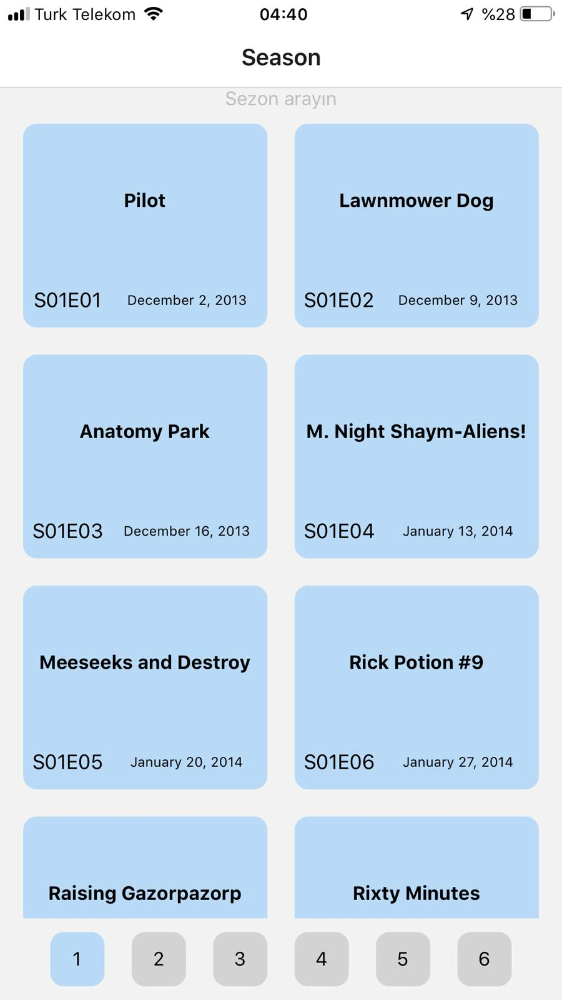
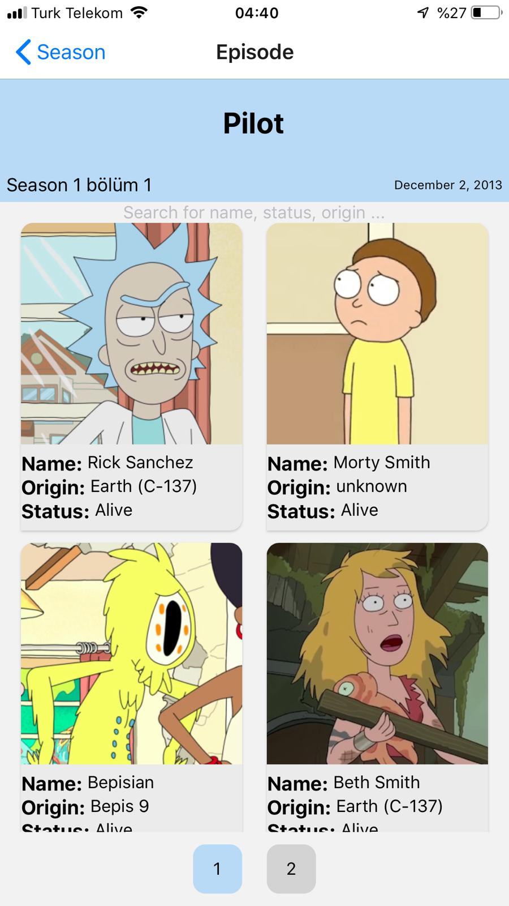
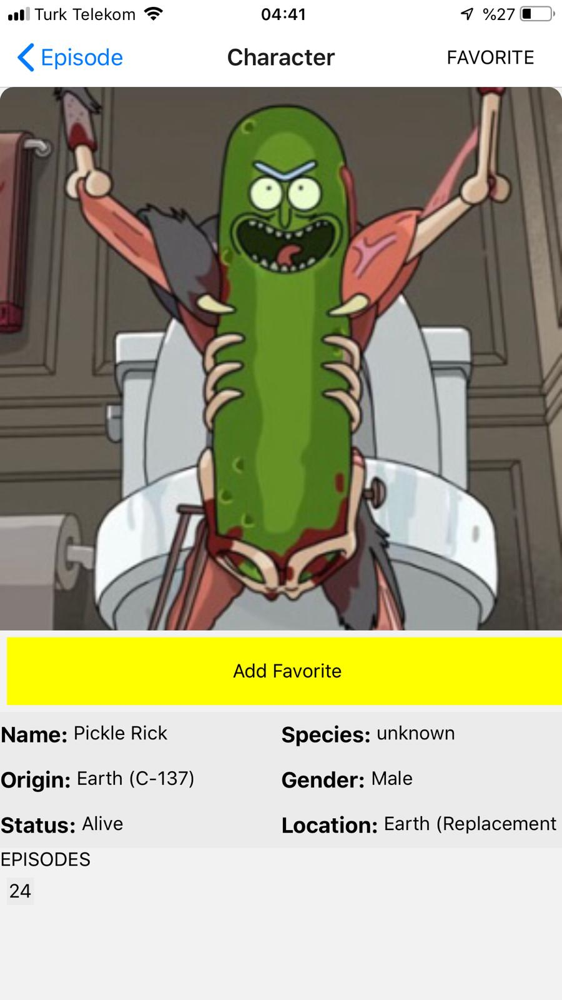
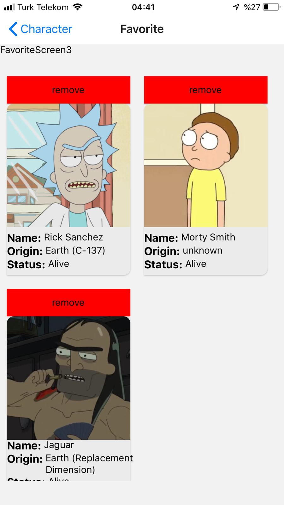
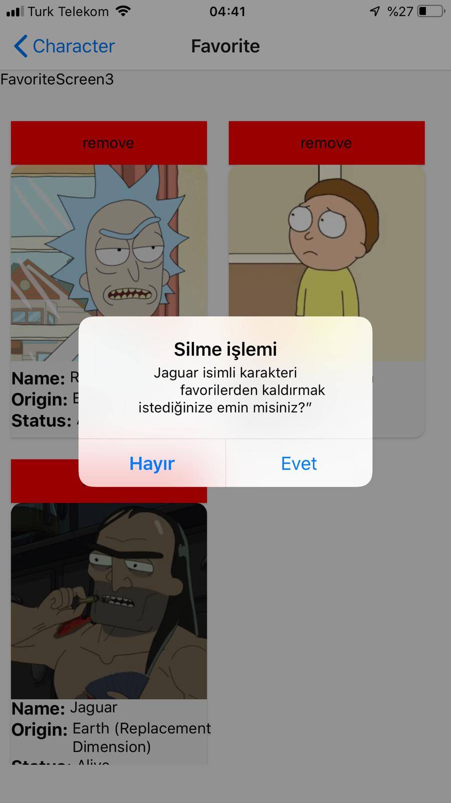

# RickAndMorty

## Technologies


<br/>

## Packages

- Expo
- Firebase
- Axios
- React Navigation
- Async Storage
- Redux Toolkit

<br/>

## Features

- Pagination
- Favorite Character
- Search Bar


<br/>


## Installation

```
npm install
npm start
```

<br/>


### ScreenShot

<table>
    <tbody>
        <tr>
            <td></td>
            <td></td> 
            <td></td> 
        </tr>
        <tr>
            
            <td></td> 
            <td></td> 
        </tr>
    </tbody>
</table>
